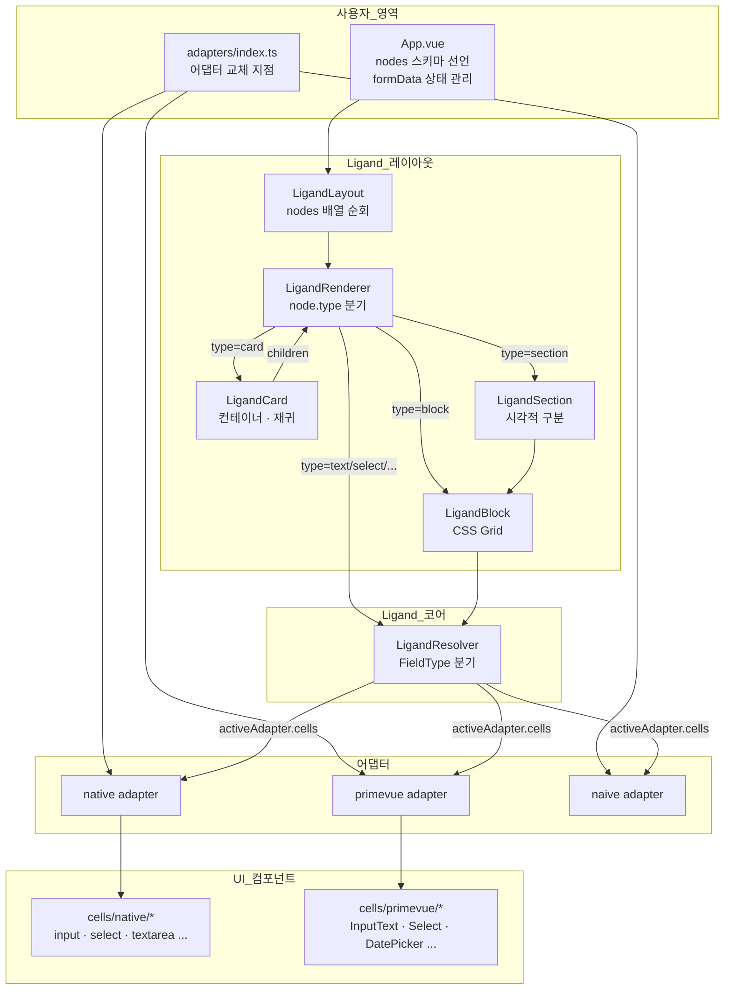
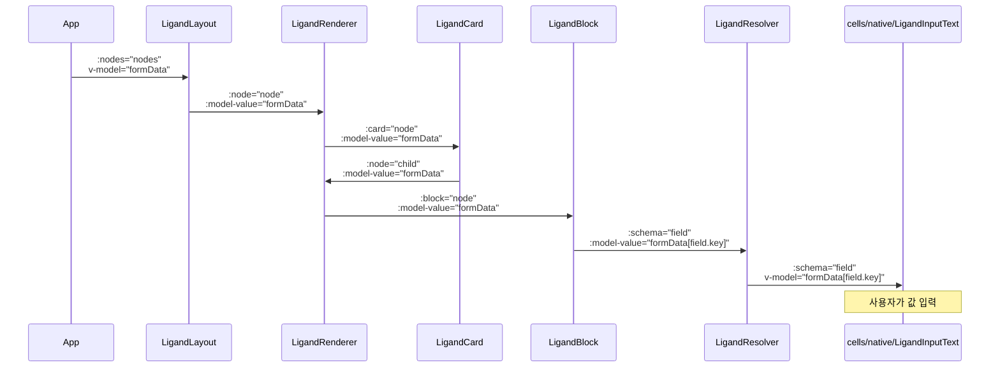
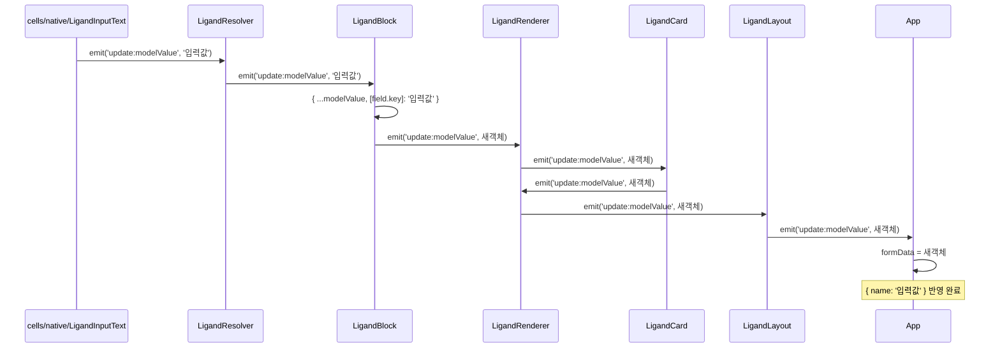
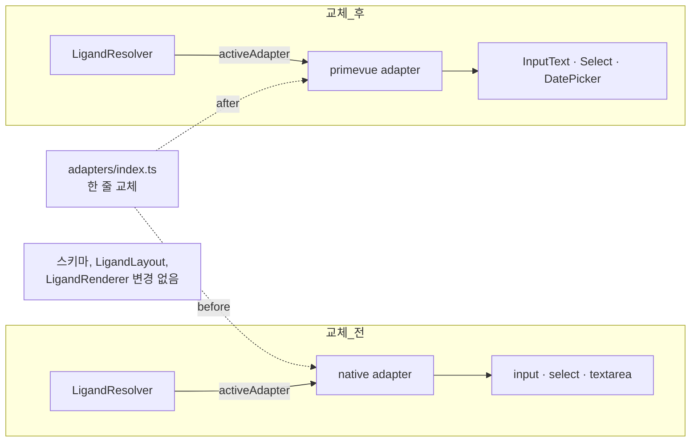

# Ligand-vue Architecture

## 1. 전체 구조

---

## 2. 데이터 흐름 (위 → 아래)

---

## 3. 이벤트 흐름 (아래 → 위)

---

## 4. 어댑터 교체 메커니즘

---

## 핵심 원칙 요약

| 레이어 | 역할 | 교체 가능 여부 |
|---|---|---|
| `LigandLayout / Renderer / Card` | 노드 트리 순회 · 분기 | 교체 불필요 |
| `LigandBlock` | CSS Grid 배치 | 교체 불필요 |
| `LigandResolver` | FieldType → 셀 컴포넌트 선택 | 교체 불필요 |
| `adapters/index.ts` | 어떤 어댑터를 쓸지 결정 | **여기만 교체** |
| `cells/native/*` `cells/primevue/*` | 실제 UI 컴포넌트 래퍼 | 어댑터별 구현 |
| `tokens.css` | `--ligand-*` 디자인 토큰 | 값만 덮어쓰기 |

---

## 6. 주요 이점

### 🎯 프레임워크 독립성
- 스키마, 레이아웃, 렌더링 로직을 건드리지 않고 어댑터만 교체 가능
- Native HTML에서 PrimeVue, Naive UI로 최소한의 변경만으로 전환 가능

### 📦 조합 가능한 아키텍처
- 레이아웃 컴포넌트는 구조를 담당
- Resolver는 필드 타입 로직을 담당
- 어댑터는 프레임워크 통합을 담당
- 명확한 관심사 분리

### ♿ 접근성 및 테마
- `tokens.css`에 집중된 디자인 토큰 관리
- 어댑터 전반에 걸친 일관된 컴포넌트 동작
- CSS 변수를 통한 테마 전환 지원

### 🔄 양방향 바인딩
- 데이터는 최상위 상태에서 하위 컴포넌트로 흘러 내려감
- 사용자 입력은 이벤트 발행을 통해 위로 전달됨
- `App.vue` 또는 부모 컴포넌트가 단일 진실 공급원