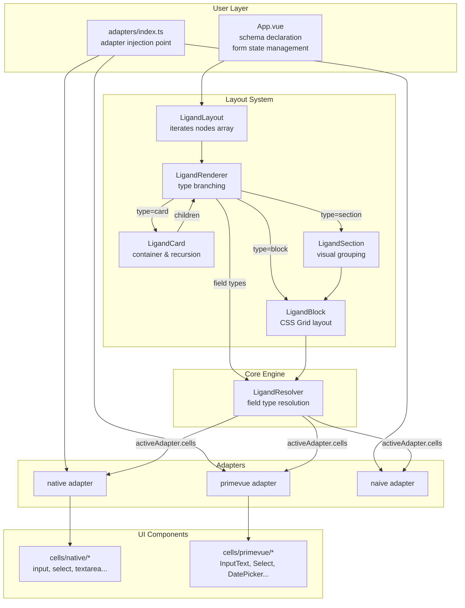
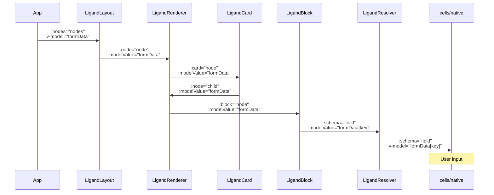
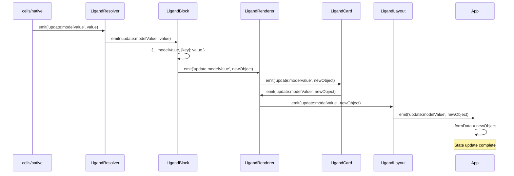
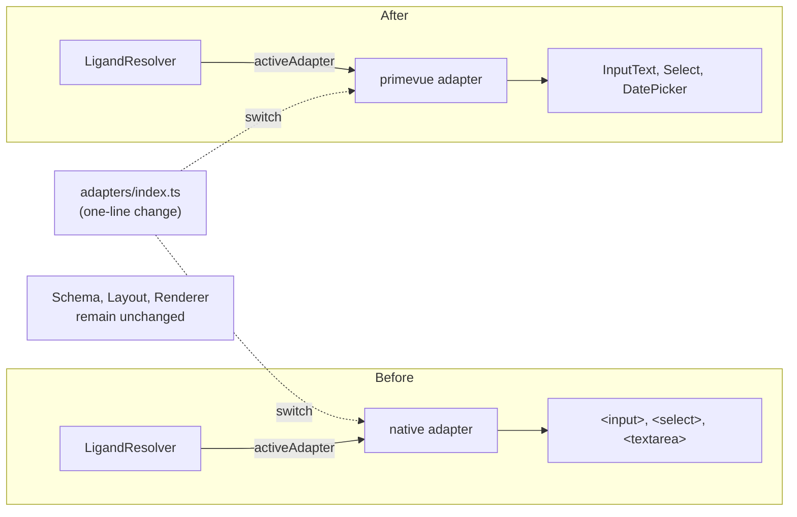

# Ligand-vue Architecture

## 1. Overall Architecture

---

## 2. Data Flow (Top-Down)

---

## 3. Event Flow (Bottom-Up)

---

## 4. Adapter Switching Mechanism

---

## 5. Core Principles

| Layer | Responsibility | Replaceable |
|-------|---|---|
| `LigandLayout` / `Renderer` / `Card` | Node tree traversal & branching | ❌ Not needed |
| `LigandBlock` | CSS Grid layout & field arrangement | ❌ Not needed |
| `LigandResolver` | Field type → cell component selection | ❌ Not needed |
| `adapters/index.ts` | Adapter selection | ✅ **Change here only** |
| `cells/native/*` `cells/primevue/*` | UI component implementations | Per-adapter |
| `assets/tokens.css` | Design tokens (`--ligand-*`) | Override values |

---

## 6. Key Benefits

### 🎯 Framework Agnostic
- Replace adapters without touching schema, layout, or rendering logic
- Switch from native HTML to PrimeVue to Naive UI with minimal changes

### 📦 Composable Architecture
- Layout components handle structure
- Resolvers handle field type logic
- Adapters handle framework integration
- Clear separation of concerns

### ♿ Accessibility & Theming
- Centralized design tokens in `tokens.css`
- Consistent component behavior across adapters
- Theme switching supported via CSS variables

### 🔄 Two-way Binding
- Data flows from top-level state down through components
- User input bubbles up through event emission
- Single source of truth in `App.vue` or parent component
